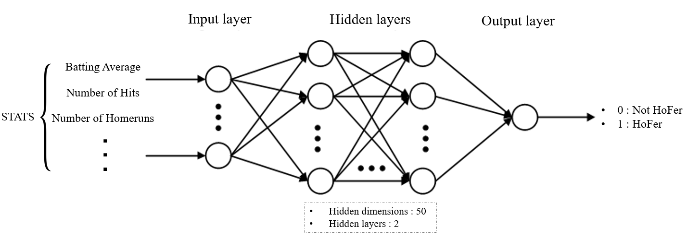
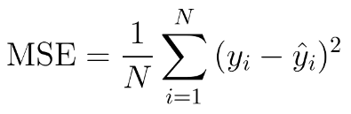
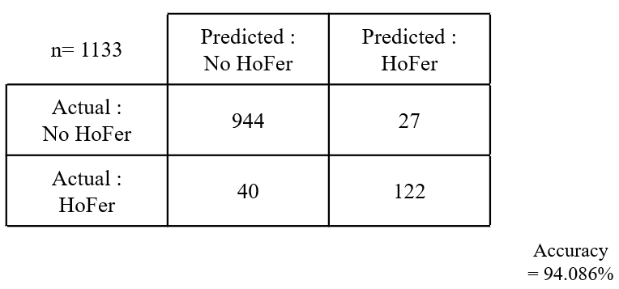
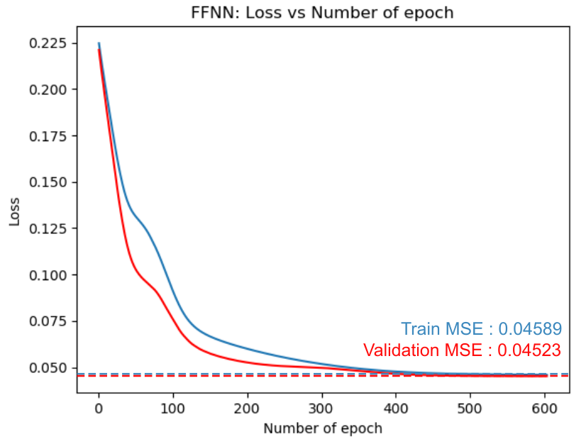
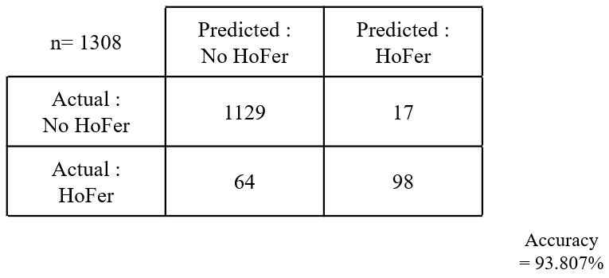
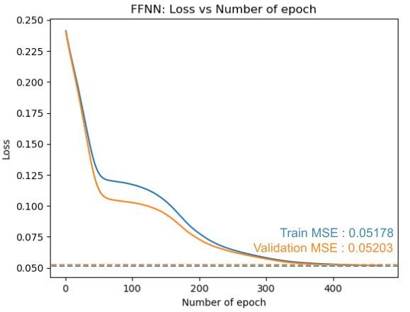

# Introduction: Who will be the Hall of Famer (HoFer)?

The MLB hall of fame, which gives the greatest honor to the legendary MLB players in baseball history, always draws attraction of MLB fans. But prediction of HoFer could be difficult, because too many factors could affect to the possibility of being HoFers. Now, we are trying to predict the future HoFers by using machine learning method which we have learned on CS7641 class. The class introduced both unsupervised learning and supervised learning approaches, and we will apply both approaches to predict the HoFers because our team is graduate student team.
# Our Approach
## Unsupervised learning : Clustering Algorithm
We will use various clustering analysis to group the player whether he could be HoFer or not. Kmeans clustering, hierarchical clustering, DBSCAN, and GMM method are good candiates for analysis. 
## Supervised learning: Neural Network
Neural network can classify the object when the number of given data sets are sufficient. 

# Data Collection and Filtering
We gathered the data from the website of [Baseball Reference](https://www.baseball-reference.com/).
  
These data are containing the players who is absolutely not eligible to Hall of Fame, so we need to reduce the size of data set by filtering them. We have cut off the data of player who has <b>BA is lower than 0.2 and WAR lower than 10.</b>

# Chosen statitics lists
For data anlysis, we use feature sets belows. Theses features are crucial data sets which show the player's performance clearly and draft 
1. BA (Batting AVerage)
2. WAR (Wins Above Replacement)
3. G (Game)
4. R (Runs Scored)
5. H (Hits)
6. 2B (Double)
7. 3B (Triple)
8. HR (Home Run)
9. RBI (Run Batted In)
10. BB (Walk)
11. SB (Stolen Base)
12. OBP (On-Base Percentage)
13. SLG (Slugging Average)

# Data Categorize
We categorize the data for two category. Data 1 is including MLB player's all-time data and data 2 is containing the data of the first 10 years. With the-first-10-year data of HoFers, we could predict the probability of being Hofers of rookies who have not spend 10 years as a player.
## Data Set 1: All-time data
- Filtering Conditions
    - the number of games played by the player > 1000
    - BA > 0.2
    - WAR >= 10
## Data set 2: the-first-10-year data
 - Filtering Conditions
    - BA in the first 10 years> 0.2 
    - WAR in the first 10 years >= 10

# Analysis: Unsupervised Learning with Clustering Algorithms
## Paramters for clustering
- KMeans
    - K = 2
- Hierarchical
    - Cut to make 2 clusters
- DBSCAN
    - 3D DBSCAN, 10-year: (eps=0.95, minPts=8)
    - All other datasets: (eps=0.75, minPts=8)
- GMM
    - With 2 / 4 Mixtures

## Data Preprocessing
The following steps are used for preprocessing
1. Normalize the data set by column
    - Normalized data= (data - mean) / std
2. Apply PCA in order to reduce dimensionality
3. Categorize the players with various clustering algorithm
4. Check whether HoFers are included in the different cluster of non HoFers

## Clustring Result : Data set 1
### PCA Component analysis
all-year
PCA 2: [57.49%, 15,65%] (73.14%)
PCA 3: [57.49%, 15.65%, 10.46%] (83.60%)
### Clustering based on PCA components
Legend
- 2D
    - Blue: Non-HoF
    - Orange: HoF
- 3D
    - Yellow: Non-HoF
    - Purple: HoF

Ground truth 그래프를 통해 살펴보면
그래프의 outlier은 거의 대부분 HoF 선수들입니다.
다만 outlier가 아닌 선수들 중에서도 HoF는 분명히 존재합니다.
kmeans 같이 outlier를 못 잡아내는 clustering 알고리즘으로는 분류 불가능합니다.
hierarchical은 outlier에 특화된 알고리즘이 아니므로, 정확하게는 분류하지 못하지만 엄청난 outlier들은 잡아낼 수 있습니다.
outlier을 잘 찾아내는 clustering 알고리즘들로는 그래도 정확하게 HoFer을 구분해낼 수 있습니다.
DBSCAN은 outlier들을 상당히 정확하게 분류할 수 있고, GMM도 mixture 수를 늘리면 비슷한 정확도로 outlier들을 탐색할 수 있습니다.
Unsupervised learning이므로 다른 선수와 비슷한 스탯을 보이는 HoFer들은 분류해낼 수 없었습니다.

## Clustring Result : Data set 2
### PCA Component analysis
10-year
PCA 2 : [49.40%, 16.98%] (66.38%)
PCA 3: [49.40%, 16.98%, 11.91%] (78.29%)
### Clustering based on PCA components
Legend
- 2D
    - Blue: Non-HoF
    - Orange: HoF
- 3D
    - Yellow: Non-HoF
    - Purple: HoF

데이터 자체가 all-time data와는 달리 대부분의 선수들이 뭉쳐서 분포하고, outlier가 별로 없으며, 다른 선수와 비슷한 스탯을 보이는 HoFer들이 All-time data보다 더 많습니다.
따라서 DBSCAN 등으로 탐색해도 all-time data보다는 훨씬 적은 수의 HoFer들만을 분류해냈습니다.

# Analysis: Supervised Learning with Neural Network
## Neuarl Network information
- hidden dimesion : 50
- layer 갯수 : 2
- Activation function : ReLU, 마지막에 sigmoid.
- Validation 데이터 비율 : 0.2
- Validation error 증가 epoch제한을 20으로 두어, 만약 연속으로20번동안 validation error가 증가할 경우 Stop 및 증가 이전 Trained Network가 최종. (Overfitting 방지용)
  
  

## DATA1: Train and test
Training Data set 
완전 HOF에서 탈락확정된 선수들 + HOF에 등록된 선수들이 
Test Data set
아직 은퇴한지 5년이 안되어(2015년 이후 은퇴) HOF후보군이 조건이 아직 안되었거나, 아직 후보군이어서 HOF등록의 
기회가 남은 선수들 (총 97명)
 - 리스트에 있는 97명 중 끝부분 23명이 지금까지 투표에서는 탈락하였지만 아직 후보군인 선수들입니다
## Data1 Result 
  
    
- hyper parameter들 변경 및 activation/loss function 변경해보며 테스트진행
- Validation MSE error가 대략 0.04X로 수렴.
- 아래 그래프에서 파란색이 test error, 주황색이 validation error
- Traned Network로 Training Data를 돌려 예측정확도 확인 시 에러는 약5.914% (트레이닝 때마다 약간변동)
DATA1 Test 결과 (HOF 예상, MLB_dataset_seunghyup.xlsx파일 Test&Pred탭 참조 )
- 투표 중인 선수들 중 결국 HOF될거라고 꽤 많이 예상하는데.. 이는 이 선수들이 Stat은 좋으나 소위 약쟁이 딱지가 붙어 있어 못붙고 계속 투표중인 이유가 크기 때문인듯 함.
- 아직 투표를 안한 선수 중 HOF가 될거라 예상되는 결과 선수를 보면 David Ortiz, Alex Rodriguez, Carlos Beltran, Joe Mauer, Adrian Beltre, Ichiro Suzuki 등 매우 유명했고 실제로 언론에서 HOF의 확률이 높다는 선수들임.
 : 나름 어느정도 정확도가 있다고 말할 수 있을듯함(?)

## DATA2: Train and test
Training Data set
Test Data set
이중에서 은퇴 후 완전 HOF에서 탈락확정된 선수들 + HOF에 등록된 선수들이 초반 10년 누적기록이
현역선수들 초반 10년 누적 데이터
## Data2 Result 
  
  
- 동일한 방식으로 Training 진행
- 아무래도 HOF가 누적결과를 바탕으로 결정되는것이고, 초반 10년성적만으로 그 선수의 누적결과를 보장하는게 아니라 이전보다는 정확도가 낮게 나옴. (6.XX%)
- 그래도 Test데이터로 현역 선수들 예측 시 될놈될은 잘 예측하는것 같음.
  : Albert Pujols 같은 무조건 HOF갈거라고 예측되는 선수는 99.9%확률이라고 예측합니다.
  : Mike Trout 선수는 9년치 누적결과로만 돌렸는데도 99% 확률로 예측하였습니다. (현역 최고연봉선수)

# Conclusion & Future work
As we can see in ground truth graph, Most of HoFers have exceptional statistics, so clustering algorithms which can detect the outlier well are predicting HoFers well too. But HoFers who didn't show the preeminent performance than the others cannot easily categorized with the unsupervised learning method.
Supervised learning shows great accuracy(94%) to predict the HoFers. 
We will apply this analysis to pitcher HoFers. 

# References 
[1] https://baseballhall.org/hall-of-famers/rules/bbwaa-rules-for-election
