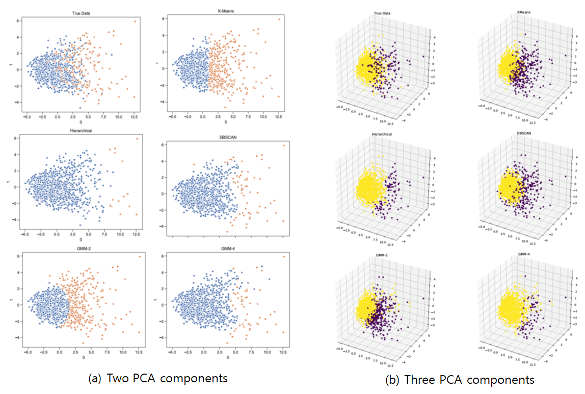

# Introduction: Who will be the Hall of Famer (HoFer)?

The MLB hall of fame(HoF), which awards to the legendary MLB players in baseball history, always draws attraction of MLB fans. But a prediction of HoFer could be difficult because too many factors could affect to the possibility of being HoFers. Now, we are trying to predict the future HoFers by using machine learning method which we have learned on CS7641 class. The lecutre on the class introduced both unsupervised learning and supervised learning approaches, and we will apply both approaches to predict the HoFers because our team is graduate student team.
# Our Approach
## Unsupervised learning: Clustering Algorithm
To classify the player whether he could be HoFer or not, we will use various clustering analysis; Kmeans clustering, hierarchical clustering, DBSCAN, and GMM method. These are well known approach in the unsupervised learning.
## Supervised learning: Neural Network
For the supervsied learning, we will use Neural network which can classify the object after training from input data set. 

# Data Preparation
## Data Collection and Filtering
We gathered the data of MLB players from the website of [Baseball Reference](https://www.baseball-reference.com/).

  

Because these data are containing the players who is absolutely not eligible to Hall of Fame, we need to filter out the data of them. We make a cut-off performance coniditions which are <b>BA is lower than 0.2 or WAR lower than 10. </b> And we will not deal with pitcher statistics in this project, because their statistics is very different from batters'.

## Chosen Fearue Lists
For the data anlysis, we use the 13 values belows as features of datapoints. In fact, these features are very crucial performance factor for player, so it mostly decides the player's salary.
1. BA (Batting AVerage)
2. WAR (Wins Above Replacement)
3. G (Game)
4. R (Runs Scored)
5. H (Hits)
6. 2B (Double)
7. 3B (Triple)
8. HR (Home Run)
9. RBI (Run Batted In)
10. BB (Walk)
11. SB (Stolen Base)
12. OBP (On-Base Percentage)
13. SLG (Slugging Average)

## Data Categorize
We categorize the data for two categories. 
- <b> Data 1</b> is including MLB player's all-time data The performance in whole life of HoFer (or non-Hofer) will tell why they are HoFer (or not). But it might not predict the result of rookie who does not have enough data in sufficient period. 

- <b>Data 2</b> is containing the data of the first 10 years. With the-first-10-year data, we could predict the probability of being Hofers of rookies who have not yet spent over 10 years as a baseball player 

# Unsupervised Learning: Clustering Algorithms
## Parameters for Clustering Algorithms
We tuned the parameter of clustering algorithms to achieve high accuracy.
1. KMeans[2]
    - K = 2
2. Hierarchical 
    - Make 2 clusters
3. DBSCAN
    - Data set 1: (eps=0.75, minPts=8)
    - Data set 2: (eps=0.95, minPts=8)
4. GMM
    - With 2 / 4 Mixtures

## Data Preprocessing
The following steps are used for preprocessing
1. Normalize the data set by column
    - Normalized data= (data - mean) / std
2. Apply PCA in order to reduce dimensionality (2D/3D)
3. Categorize the players with various clustering algorithm
4. Check whether HoFers are included in the different cluster of non HoFers

## PCA Component analysis
For each data set, we will choose to use two or three primary components from PCA component analysis[3]. The graph belows shows that using three PCA can describe the original data set more precisely(All-time data: 73% Vs 84$, 10-year data: 66% Vs. 78%), and when the number of PCA components are same, then all-time data preserve more information than 10-year data.

## Clustering Result: Data Set 1 (All time)
If we look through the ground truth, the outliers in the graph are mostly HoFers. However, if HoFers exists among non-outlier players, we cannot classify them by using clustering algorithms which cannot catch outliers. Kmean is a good exmaple for that. Also, Hierarchical clustering cannot classify the data accurately, even though it can catch some prominent outliers. DBSCAN can classify outliers fairly accurately, and GMM can also search outliers with similar accuracy by increasing the number of mixtures. 

Here are legend for above graphs. we will use same legent in Data set 2 part again.
    <Legend>
    - Two PCA components
        - Blue: Non-HoF
        - Orange: HoF
    Three PCA components
        - Yellow: Non-HoF
        - Purple: HoF

## Clustering Result: Data Set 2 (10 years)
As we shorten the period of performance measurement, more and more HoFers shows similar stats with other players. Therefore, even when searching with DBSCAN, only a fraction of HoFers were classified than all-time data. We expected that 10-year data predict the HoFer well, but it does not happen.

# Supervised learning: Neural Network
## Neuarl Network information
- Neural Network[4] Architecture and Parameters
    
    - hidden dimesion : 50
    - The number of layers : 2
    - Activation function : ReLU, sigmoid (the last only)
    - Validation data ratio : 0.2

- For preventing overfitting, if the validation error increases for 20 epoch in a row, we stop there and set final neural network as the trained network before validation error increases
- we use MSE(Mean-sqaure error) to calculate the error

  

## Training and Test for Neural Network
- Data Set 1 (All Time)
   - Players who are confirmed to be eliminated from the complete HOF players - registered in the HOF. Players with chance (total 97)
   - On that list, 23 at the end have not been elected from the vote so far, but they are still candidates.
- Data Set 2 (10 Years)
    - Among them, players who are determined to drop out of the complete HOF after retirement + players registered in the HOF have a cumulative record of the first 10 years. Current players' cumulative data for the first 10 years

## Results: Data Set 1 (All Time)

The graph belows shows that the loss, Train MSE, and Validation MSE are successfully saturated.

 

The table belows shows that the confusion matrix in Data Set 1 case. We acheive 94.086% accuracy.

As shown in the graph, validation MSE error converges to approximately 0.04X.
 The total error is about 5.9% when the prediction accuracy is checked by turning the training data through the Traned Network (varies slightly with each training) DATA1 Test result (HOF expected). We expect quite a lot of players who are voting to eventually become HOF. This seems to be because these players are good at stats, but they are suspected of taking medication. Among those who haven't voted yet are expected to be HOF, the players, e.g. David Ortiz, Alex Rodriguez, Carlos Beltran, Joe Mauer, Adrian Beltre, Ichiro Suzuki, etc.

## Results: Data Set 2 (10 Years)

The graph belows shows that the loss, Train MSE, and Validation MSE are successfully saturated.

 
  
 The table belows shows that the confusion matrix in Data Set 1 case. We acheive 93.807% accuracy which is lower than the prediction from Data Set 1
  
 
  
 The HOFer is determined based on the cumulative result, and the accuracy of the player's cumulative result is lower than the previous 10 years. (about 6%) Still, it seems to predict well on test data. A player who is predicted to go HOF unconditionally, like Albert Pujols, predicts a 99.9% probability. Mike Trout predicted with a 99% probability even though he only ran with the cumulative result of 9 years. By considering He is The best annual salary player in this year, our prediction seems to be good enough.

# Conclusion & Future work
As we can see in ground truth graph, Most of HoFers have exceptional statistics, so clustering algorithms which can detect the outlier well are predicting HoFers well too. But HoFers who didn't show the preeminent performance than the others cannot easily categorized with the unsupervised learning method.
Supervised learning shows great accuracy(94%) to predict the HoFers. 
In the future, We will apply this analysis to pitcher HoFers. 

# References 
[1] https://baseballhall.org/hall-of-famers/rules/bbwaa-rules-for-election

[2] Lloyd, Stuart P. (1957). "Least square quantization in PCM". Bell Telephone Laboratories Paper. Published in journal much later: Lloyd, Stuart P. (1982). "Least squares quantization in PCM" (PDF). IEEE Transactions on Information Theory. 28 (2): 129–137. CiteSeerX 10.1.1.131.1338. doi:10.1109/TIT.1982.1056489. Retrieved 2009-04-15.

[3]    Ian  T  Jolliffe  and  Jorge  Cadima.  “Principal  component  analysis:  a  review  and  recent  developments”.In:Philosophical Transactions of the Royal Society A: Mathematical, Physical and Engineering Sciences374.2065 (2016).

[4]    BRUCE  W  SUTER.  “The  multilayer  perceptron  as  an  approximation  to  a  Bayes  optimal  discriminantfunction”. In:IEEE Transactions on Neural Networks1.4 (1990), p. 291.