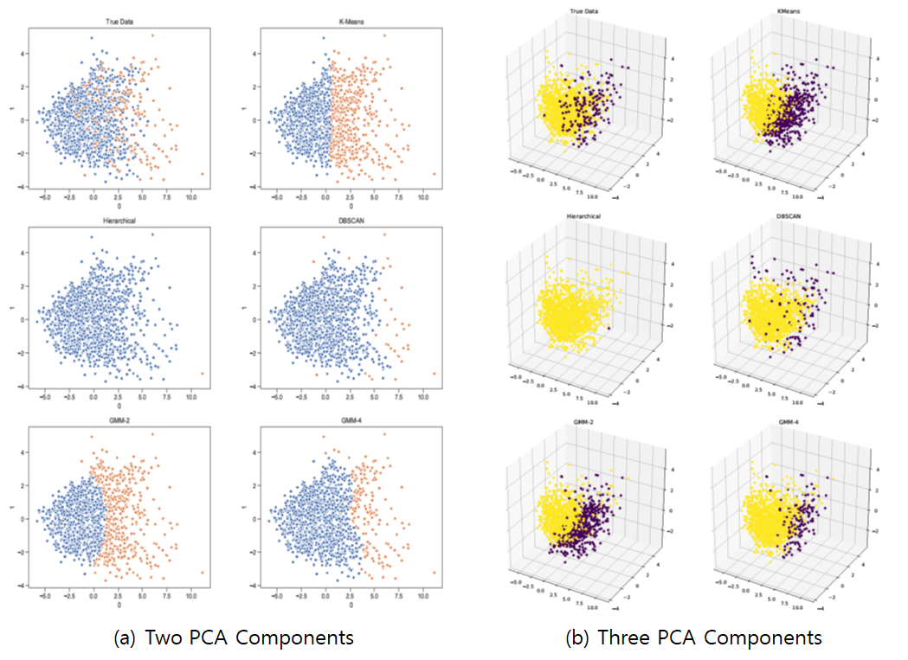

# Introduction: Who will be the Hall of Famer (HoFer)?

The MLB hall of fame, which award the greatest honor to the legendary MLB players in baseball history, always draws attraction of MLB fans. But prediction of HoFer could be difficult, because too many factors could affect to the possibility of being HoFers. Now, we are trying to predict the future HoFers by using machine learning method which we have learned on CS7641 class. The class introduced both unsupervised learning and supervised learning approaches, and we will apply both approaches to predict the HoFers because our team is graduate student team.
# Our Approach
## Unsupervised learning: Clustering Algorithm
We will use various clustering analysis to group the player whether he could be HoFer or not. Kmeans clustering, hierarchical clustering, DBSCAN, and GMM method are good candiates for analysis. 
## Supervised learning: Neural Network
Neural network can classify the object when the number of given data sets are sufficient. 

# Data Collection and Filtering
We gathered the data from the website of [Baseball Reference](https://www.baseball-reference.com/).

  

These data are containing the players who is absolutely not eligible to Hall of Fame, so we need to reduce the size of data set by filtering them. We have cut off the data of player who has <b>BA is lower than 0.2 and WAR lower than 10, </b> and we do not deal with pitcher statistics in this project.

# Chosen Fearue Lists
For data anlysis, we use the feature sets belows. Theses features are crucial data sets in the player draft or selection because they show the player's performance clearly
1. BA (Batting AVerage)
2. WAR (Wins Above Replacement)
3. G (Game)
4. R (Runs Scored)
5. H (Hits)
6. 2B (Double)
7. 3B (Triple)
8. HR (Home Run)
9. RBI (Run Batted In)
10. BB (Walk)
11. SB (Stolen Base)
12. OBP (On-Base Percentage)
13. SLG (Slugging Average)

These statistics are only for batters, because pitchers uses totally different statistics.

# Data Categorize
We categorize the data for two categories. <b> Data 1</b> is including MLB player's all-time data and <b> Data 2</b> is containing the data of the first 10 years. With the-first-10-year data, we could predict the probability of being Hofers of rookies who have not spend over 10 years as a player yet

# Analysis: Unsupervised Learning with Clustering Algorithms
## Paramters for Clustering Algorithms
For the Kmeans, Hierarchical clustering, they require to have only two groups which are whether HoFer or not.
1. KMeans
    - K = 2
2. Hierarchical
    - Cut to make 2 clusters
3. DBSCAN
    - Data set 1: (eps=0.75, minPts=8)
    - Data set 2: (eps=0.95, minPts=8)
4. GMM
    - With 2 / 4 Mixtures

## Data Preprocessing
The following steps are used for preprocessing
1. Normalize the data set by column
    - Normalized data= (data - mean) / std
2. Apply PCA in order to reduce dimensionality (2D/3D)
3. Categorize the players with various clustering algorithm
4. Check whether HoFers are included in the different cluster of non HoFers

## PCA Component analysis
For each data set, we will use two or three primary components from PCA component analysis. The graph belows shows that using three PCA components can describe the original data set more precisely, and when the number of PCA components are same, then all-time data preserve more information than 10-year data.

## Clustring Result: Data Set 1 (All time)

If we look through the ground truth, the outliers in the graph are mostly HoFers. However, HoFers certainly exists among non-outlier players, and we cannot classify them with clustering algorithms which cannot catch outliers, like kmeans. Hierarchical clustering is not an outlier-specific algorithm, so it can't be classified accurately, but it can catch prominent outliers. DBSCAN can classify outliers fairly accurately, and GMM can also search outliers with similar accuracy by increasing the number of mixtures. Because it is unsupervised learning, HoFers with similar stats to other players cannot be classified.

Legend
- Two PCA components
    - Blue: Non-HoF
    - Orange: HoF
- Three PCA components
    - Yellow: Non-HoF
    - Purple: HoF

## Clustring Result: Data Set 2 (10 year)
Unlike the all-time data itself, most players are aggregated and distributed, there are few outliers, and there are more HoFers than all-time data that show similar stats to other players. Therefore, even when searching with DBSCAN, only a fraction of HoFers were classified than all-time data.

# Analysis: Supervised Learning with Neural Network
## Neuarl Network information
- Neural Network Architecture 

- hidden dimesion : 50
- The number of layers : 2
- Activation function : ReLU, sigmoid (the last only)
- Validation data ratio : 0.2

For preventing overfitting, if the validation error increases for 20 epoch in a row, we stop there and set final neural network as the trained network before validation error increases. and we use MSE(Mean-sqaure error) to calculate.

  

## DATA1: Train and Test

Training Data set
Players who are confirmed to be eliminated from the complete HOF + players registered in the HOF
Test Data set
It has not been 5 years since he retired (retired after 2015).
Players with chance (total 97)
 -Of the 97 on the list, 23 at the end have been eliminated from the vote so far, but they are still candidates.

## Data1 Result 

  
    
 As shown in the graph, validation MSE error converges to approximately 0.04X.
 The total error is about 5.9% when the prediction accuracy is checked by turning the training data through the Traned Network (varies slightly with each training) DATA1 Test result (HOF expected). We expect quite a lot of players who are voting to eventually become HOF. This seems to be because these players are good at stats, but they are suspected of taking medication. Among those who haven't voted yet are expected to be HOF, the players, e.g. David Ortiz, Alex Rodriguez, Carlos Beltran, Joe Mauer, Adrian Beltre, Ichiro Suzuki, etc.

## Data2: Train and Test
Among them, players who are determined to drop out of the complete HOF after retirement + players registered in the HOF have a cumulative record of the first 10 years. Current players' cumulative data for the first 10 years

## Data2 Result 
  
  

 The HOFer is determined based on the cumulative result, and the accuracy of the player's cumulative result is lower than the previous 10 years. (6.XX%) Still, it seems to predict well what will be expected when predicting active players with test data. A player who is predicted to go HOF unconditionally like Albert Pujols predicts a 99.9% probability. Mike Trout predicted with a 99% probability even though he only ran with the cumulative result of 9 years. (He is The best annual salary player)

# Conclusion & Future work
As we can see in ground truth graph, Most of HoFers have exceptional statistics, so clustering algorithms which can detect the outlier well are predicting HoFers well too. But HoFers who didn't show the preeminent performance than the others cannot easily categorized with the unsupervised learning method.
Supervised learning shows great accuracy(94%) to predict the HoFers. 
We will apply this analysis to pitcher HoFers. 

# References 
[1] https://baseballhall.org/hall-of-famers/rules/bbwaa-rules-for-election
